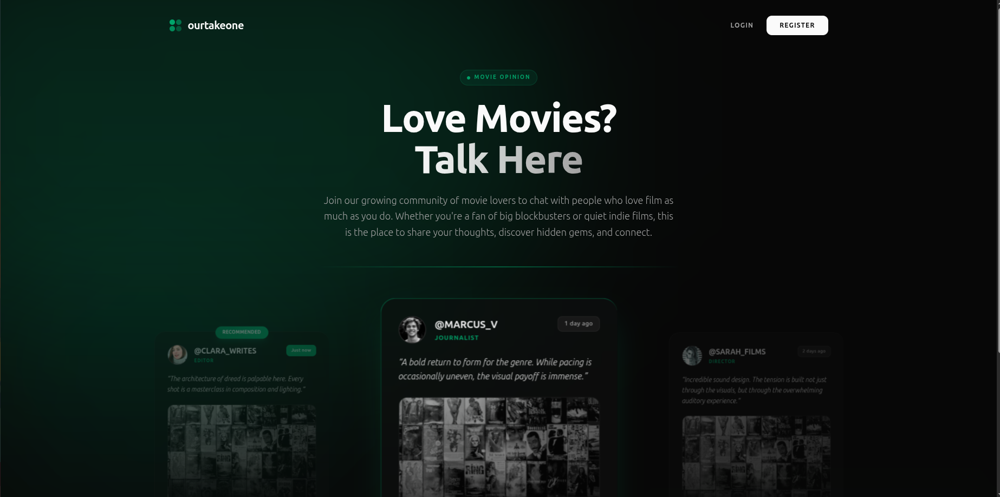
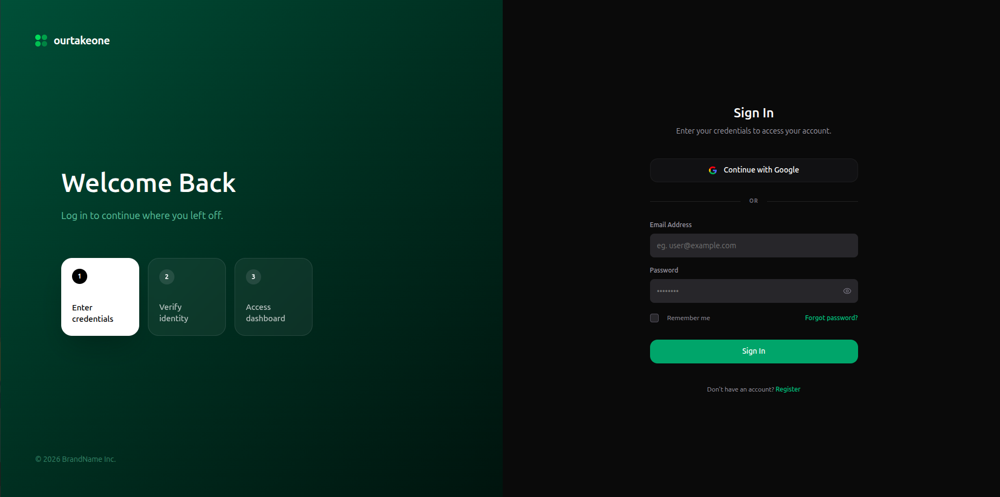
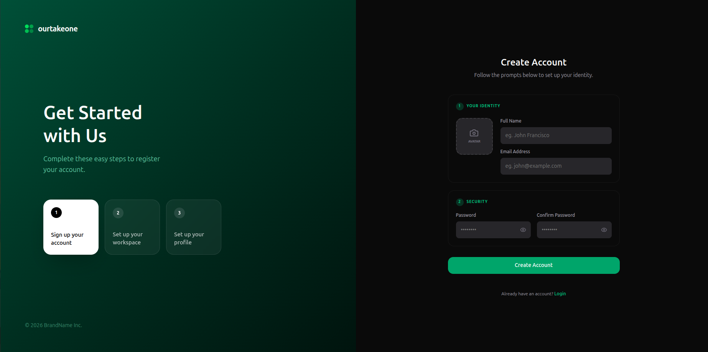
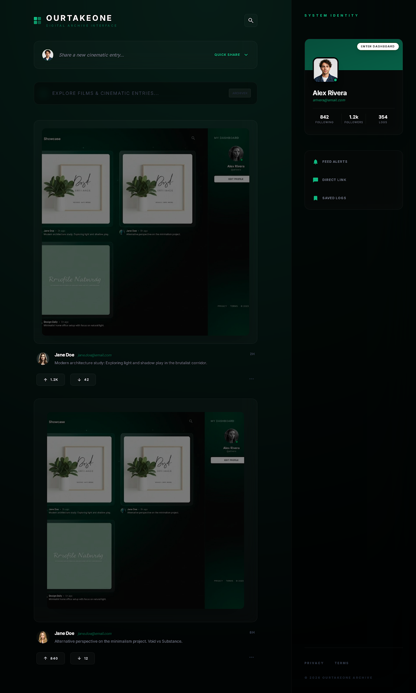

<div align="center">
  
</div>

<h1 align="center">OurTakeOne</h1>

## Overview

The site is a place where people can share their thoughts and opinions on the movies they watched.

## UI

### Landing



### Login



### Register



### Dashboard



## Technologies Used

- **Backend:** Laravel 12 (PHP 8.2+)
- **Frontend:** Vue.js 3, Inertia.js
- **Styling:** Tailwind CSS
- **Database / Caching:** MySQL/PostgreSQL, Redis
- **Documentation:** Scramble (Swagger)

## Deployment (Railway)

Set these variables in Railway (Service → Variables):

- `APP_ENV=production`
- `APP_DEBUG=false`
- `APP_KEY` (generate with `php artisan key:generate --show`)
- `APP_URL` (your public Railway URL, including `https://`)
- Database vars (whichever style you use): `DATABASE_URL` or `DB_CONNECTION` + `DB_HOST` + `DB_PORT` + `DB_DATABASE` + `DB_USERNAME` + `DB_PASSWORD`

Notes:

- This app uses `SESSION_DRIVER=database` by default, so the `sessions` table must exist (run migrations on deploy).
- If you use Google login, ensure `GOOGLE_CLIENT_ID`, `GOOGLE_CLIENT_SECRET`, and `GOOGLE_REDIRECT_URI` match your Railway URL.
- If you hit `413 Request Entity Too Large (nginx)` (often from large form payloads/uploads), increase `CLIENT_MAX_BODY_SIZE`, `PHP_UPLOAD_MAX_FILESIZE`, and `PHP_POST_MAX_SIZE`.

## Key Features

- **API for Movie Recommendations:**
  Integrate a third-party movie API (e.g., TMDb) to fetch and serve trending and recommended movie data. Users can save their favorite movies.
- **User Authentication and Preferences:**
  Implement JWT-based user authentication for secure access. Create models to allow users to save and retrieve favorite movies.
- **Performance Optimization:**
  Use Redis for caching trending and recommended movie data to reduce API call frequency and improve response time.
- **Comprehensive Documentation:**
  Use Swagger to document all API endpoints. Host Swagger documentation at `/api/docs` for frontend consumption.

## Database

### Entities and Attributes

- **User**: `id`, `name`, `email`, `email_verified_at`, `password`, `remember_token`, `created_at`, `updated_at`
- **Movie**: `id`, `tmdb_id`, `title`, `overview`, `poster_path`, `release_date`, `created_at`, `updated_at`
- **Review**: `id`, `user_id`, `movie_id`, `rating`, `content`, `created_at`, `updated_at`
- **Favorite**: `id`, `user_id`, `movie_id`, `created_at`, `updated_at`


## Accessing TMDB images

TMDB images can be accessed using the following URL structure:

`https://image.tmdb.org/t/p/original/<poster>`

---

## Git-Flows version control

Gitflow is an alternative Git branching model that involves the use of feature branches and multiple primary branches.

```sh
sudo apt-get install git-flow
```

Setup Git Flow

```sh
git flow init [-d]
```

[Gitflow workflow](https://www.atlassian.com/git/tutorials/comparing-workflows/gitflow-workflow)

[Merging vs. rebasing](https://www.atlassian.com/git/tutorials/merging-vs-rebasing)

[Git stash](https://www.atlassian.com/git/tutorials/saving-changes/git-stash)

### Branching Strategies

Branching strategies in Git help teams manage parallel development efforts. Understanding different models, such as GitFlow, is crucial for maintaining a clean and manageable codebase.

#### Main Branches:

- **master**: Stores production-ready code.
- **develop**: Integrates features before release.

#### Supporting Branches:

- **feature/***: Used for developing new features.
- **release/***: Prepares code for production.
- **hotfix/***: Quick fixes to production code. 

#### Usage:

GitFlow is ideal for projects with scheduled releases and multiple developers.

- **Feature Branch Workflow**:
Developers create branches for each new feature or bug fix.
Merges occur back into main or develop after code review.
- **Forking Workflow**:
Developers work in personal forks and submit pull requests to the main repository.
Common in open-source projects where contributors don’t have direct push access.

### Feature branches 


Note that feature branches combined with the develop branch is, for all intents and purposes, the Feature Branch Workflow. But, the Gitflow workflow doesn’t stop there.

Feature branches are generally created off to the latest develop branch.


#### Creating a feature branch 

Without the git-flow extensions:

```sh
git checkout develop
git checkout -b feature_branch
```

When using the git-flow extension:

```sh
git flow feature start feature_branch
```

Continue your work and use Git like you normally would.

#### Finishing a feature branch

When you’re done with the development work on the feature, the next step is to merge the feature_branch into develop.

Without the git-flow extensions:

```sh
git checkout develop
git merge feature_branch
```

Using the git-flow extensions:

```sh
git flow feature finish feature_branch
```

### Release branches

Once develop has acquired enough features for a release (or a predetermined release date is approaching), you fork a release branch off of develop. Creating this branch starts the next release cycle, so no new features can be added after this point—only bug fixes, documentation generation, and other release-oriented tasks should go in this branch. Once it's ready to ship, the release branch gets merged into main and tagged with a version number. In addition, it should be merged back into develop, which may have progressed since the release was initiated.


#### Creating a Release branches

Without the git-flow extensions:

```sh
git checkout develop
git checkout -b release/0.1.0
```

When using the git-flow extensions:

```sh
$ git flow release start 0.1.0
Switched to a new branch 'release/0.1.0'
```

#### Finishing a feature branch

Once the release is ready to ship, it will get merged it into main and develop, then the release branch will be deleted. It’s important to merge back into develop because critical updates may have been added to the release branch and they need to be accessible to new features. If your organization stresses code review, this would be an ideal place for a pull request.

Without the git-flow extensions:

```sh
git checkout main
git merge release/0.1.0
```

Or with the git-flow extension:

```sh
git flow release finish '0.1.0'
```


### Hotfix branches 

Maintenance or “hotfix” branches are used to quickly patch production releases. Hotfix branches are a lot like release branches and feature branches except they're based on main instead of develop. This is the only branch that should fork directly off of main. As soon as the fix is complete, it should be merged into both main and develop (or the current release branch), and main should be tagged with an updated version number.

Having a dedicated line of development for bug fixes lets your team address issues without interrupting the rest of the workflow or waiting for the next release cycle. You can think of maintenance branches as ad hoc release branches that work directly with main.


#### Creating a Hotfix branches

Without the git-flow extensions:

```sh
git checkout main
git checkout -b hotfix_branch
```

When using the git-flow extensions:

```sh
git flow hotfix start hotfix_branch
```

#### Finishing a Hotfix branches

Without the git-flow extensions:

```sh
git checkout main
git merge hotfix_branch
git checkout develop
git merge hotfix_branch
git branch -D hotfix_branch
```

When using the git-flow extensions:

```sh
git flow hotfix finish hotfix_branch
```


### Summary 


Here we discussed the Gitflow Workflow. Gitflow is one of many styles of Git workflows you and your team can utilize.

Some key takeaways to know about Gitflow are:

    The workflow is great for a release-based software workflow.
    Gitflow offers a dedicated channel for hotfixes to production.

The overall flow of Gitflow is:

1. A develop branch is created from main

2. A release branch is created from develop

3. Feature branches are created from develop

4. When a feature is complete it is merged into the develop branch

5. When the release branch is done it is merged into develop and main

6. If an issue in main is detected a hotfix branch is created from main

7. Once the hotfix is complete it is merged to both develop and main
